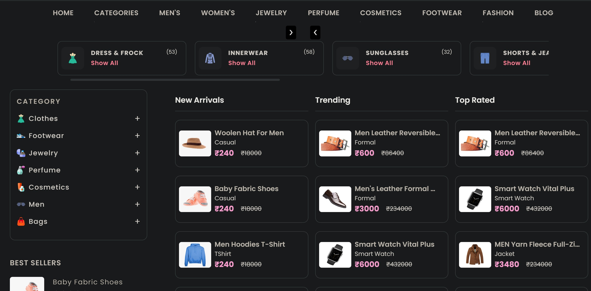
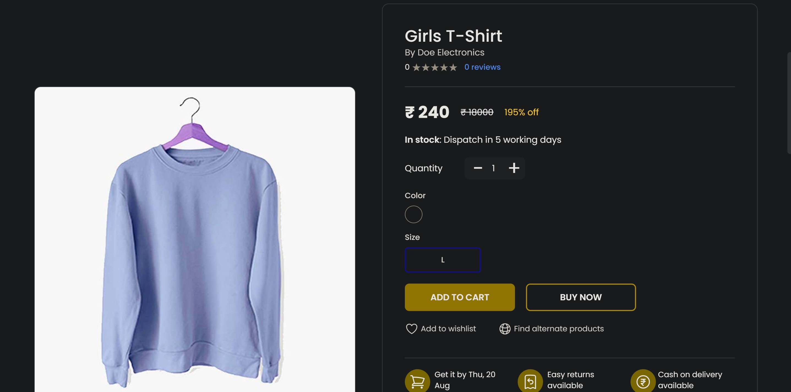
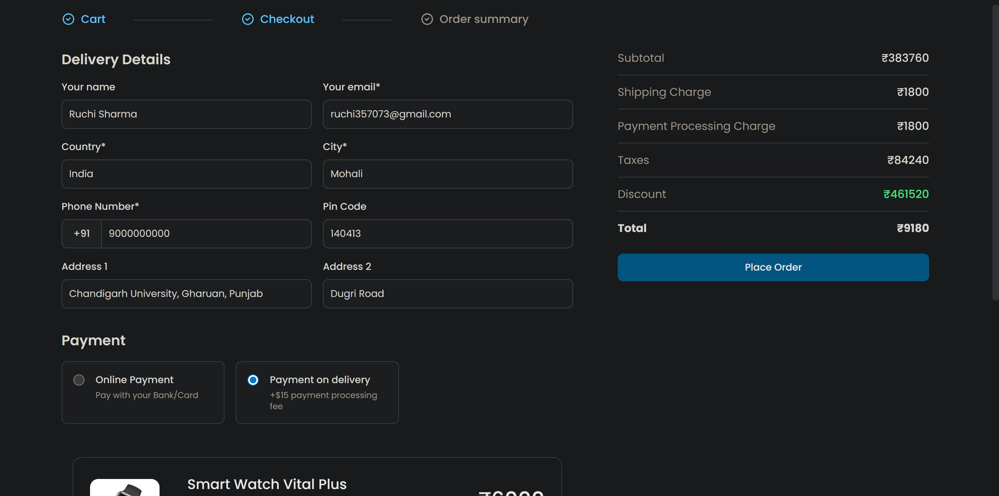

# 🛒 Auralyze - Full Stack E-Commerce Platform

<div align="center">


A modern, full-featured **E-Commerce Website** built with the **PERN Stack** (PostgreSQL, Express.js, React/Next.js, Node.js). This platform provides a complete online shopping experience with secure authentication, payment processing, and order management.

[](https://nextjs.org/)
[](https://www.typescriptlang.org/)
[](https://www.postgresql.org/)

</div>

---

## 📋 Table of Contents

- [Features](#-features)
- [Screenshots](#-screenshots)
- [Tech Stack](#-tech-stack)
- [Prerequisites](#-prerequisites)
- [Installation](#-installation)
- [Environment Configuration](#-environment-configuration)
- [Database Setup](#-database-setup)
- [Running the Application](#-running-the-application)
- [Project Structure](#-project-structure)
- [API Documentation](#-api-documentation)
- [Deployment](#-deployment)
- [Contributing](#-contributing)
- [Contact](#-contact)

---

## ✨ Features

### 🛍️ Core E-Commerce Functionality

- **Product Management**
  - Browse products by categories and subcategories
  - Detailed product pages with multiple images
  - Size and color variant selection
  - Product search and filtering
  - Sort by price, popularity, and ratings
  - Quantity selection and stock management

- **Shopping Experience**
  - Add to cart functionality
  - Wishlist management
  - Real-time cart updates
  - Product recommendations
  - Deal of the day section
  - Trending products display

- **Checkout & Payment**
  - Secure checkout process
  - Multiple payment options:
    - Stripe payment gateway (test mode)
    - Cash on Delivery (COD)
  - Order summary and confirmation
  - Email notifications

- **Order Management**
  - Order history and tracking
  - Order status updates
  - Order details view
  - Cancellation and refund requests

### 🔐 Authentication & Security

- **User Authentication**
  - Secure JWT-based sessions
  - Password encryption using bcrypt
  - Google OAuth 2.0 integration
  - Email verification with OTP
  - Password reset functionality
  - Session management

- **Security Features**
  - Rate limiting on API endpoints
  - CORS protection
  - Helmet.js security headers
  - SQL injection prevention
  - XSS protection
  - Environment variable encryption

### 📱 User Interface

- **Responsive Design**
  - Mobile-first approach
  - Tablet and desktop optimized
  - Touch-friendly interface
  - Smooth animations with Framer Motion
  - Modern UI with Tailwind CSS

- **User Features**
  - User profile management
  - Account settings
  - Address management
  - Review and rating system
  - Contact form with email support

### 📄 Additional Pages

- About Us
- Our Services
- Blog section
- Privacy Policy
- Terms and Conditions
- Refund and Cancellation Policy
- Secure Payment Information
- Contact Page with form

---

## 📸 Screenshots

### Homepage


### Product Catalog
<div align="center">

</div>

### Product Details
<div align="center">

</div>

### Shopping Cart
<div align="center">

</div>

### Checkout Process
<div align="center">

</div>

### Order Confirmation
<div align="center">

</div>

---

## 🛠️ Tech Stack

### Frontend
| Technology | Purpose |
|------------|---------|
| **Next.js 14** | React framework with SSR/SSG |
| **TypeScript** | Type-safe JavaScript |
| **Tailwind CSS** | Utility-first CSS framework |
| **Redux Toolkit** | State management |
| **Axios** | HTTP client |
| **Framer Motion** | Animation library |
| **Headless UI** | Unstyled UI components |
| **React OAuth Google** | Google authentication |
| **Stripe React** | Payment integration |

### Backend
| Technology | Purpose |
|------------|---------|
| **Node.js** | JavaScript runtime |
| **Express.js** | Web application framework |
| **TypeScript** | Type-safe JavaScript |
| **PostgreSQL** | Relational database |
| **JWT** | Authentication tokens |
| **Bcrypt** | Password hashing |
| **Nodemailer** | Email service |
| **Express Validator** | Input validation |
| **Helmet** | Security middleware |
| **Rate Limiter** | API rate limiting |

### Payment & Authentication
- **Stripe API** - Payment processing
- **Google OAuth 2.0** - Social authentication
- **JWT** - Secure token-based auth

---

## 📦 Prerequisites

Before you begin, ensure you have the following installed:

- **Node.js** (v18.0.0 or higher)
- **npm** (v9.0.0 or higher) or **yarn**
- **PostgreSQL** (v14.0 or higher)
- **Git**

### Optional Tools
- **pgAdmin** - PostgreSQL database management
- **Postman** - API testing
- **VS Code** - Recommended code editor

---

## 🚀 Installation

### Step 1: Clone the Repository

```bash
git clone https://github.com/HarmanPreet-Singh-XYT/E-Commerce.git
cd E-Commerce
```

### Step 2: Install Server Dependencies

```bash
cd Server
npm install
```

### Step 3: Install Client Dependencies

```bash
cd ../Client
npm install
```

---

## ⚙️ Environment Configuration

### Client Environment Variables

Create a `.env` file in the `Client` directory:

```env
# Backend API URL
BACKEND_URL=http://localhost:3500

# Authentication Keys
AUTH_KEY=your_secure_auth_key_here
JWT_KEY=your_secure_jwt_key_here

# Google OAuth
NEXT_PUBLIC_FRONTEND_GOOGLE_CLIENT_ID=your_google_client_id

# Stripe Payment
NEXT_PUBLIC_STRIPE_PUBLISHABLE_KEY=your_stripe_publishable_key

# Frontend Domain
NEXT_PUBLIC_DOMAIN=http://localhost:3000
```

### Server Environment Variables

Create a `.env` file in the `Server` directory:

```env
# Frontend Configuration
FRONTEND_SERVER_ORIGIN=http://localhost:3000

# Database Configuration
DB_USER=postgres
DB_PASS=your_database_password
DB_HOST=localhost
DB_PORT=5432
DB_NAME=ecommerce

# SMTP Email Configuration
SMTP_USER=your_email@gmail.com
SMTP_SUPPORT=support@yourdomain.com
SMTP_HOST=smtp.gmail.com
SMTP_SENDERNAME=Auralyze E-Commerce
SMTP_PASS=your_gmail_app_password

# JWT Configuration
JWT_ENCRYPTION_KEY=your_secure_encryption_key
JWT_AUTH_KEY=your_secure_auth_key

# Google OAuth
GOOGLE_CLIENT_ID=your_google_client_id
GOOGLE_CLIENT_SECRET=your_google_client_secret

# Stripe Payment
STRIPE_SECRET_KEY=your_stripe_secret_key
STRIPE_PUBLISHABLE_KEY=your_stripe_publishable_key
```

### 🔑 How to Get API Keys

#### Google OAuth Setup
1. Go to [Google Cloud Console](https://console.cloud.google.com/)
2. Create a new project
3. Enable Google+ API
4. Create OAuth 2.0 credentials
5. Add authorized redirect URIs:
   - `http://localhost:3000`
   - `http://localhost:3000/api/auth/callback/google`

#### Stripe Setup
1. Sign up at [Stripe](https://stripe.com/)
2. Get your test API keys from the Dashboard
3. Use test mode for development

#### Gmail SMTP Setup
1. Enable 2-Factor Authentication on your Gmail account
2. Generate an App Password
3. Use the app password in `SMTP_PASS`

---

## 🗄️ Database Setup

### Step 1: Create PostgreSQL Database

```bash
# Login to PostgreSQL
psql -U postgres

# Create database
CREATE DATABASE ecommerce;

# Exit psql
\q
```

### Step 2: Import Database Schema

```bash
# Navigate to project root
cd E-Commerce

# Import the SQL file
psql -U postgres -d ecommerce -f ecommerce.sql
```

### Step 3: Verify Database Setup

```bash
# Login to the database
psql -U postgres -d ecommerce

# List all tables
\dt

# Exit
\q
```

### Database Tables

The database includes the following tables:
- `users` - User accounts and authentication
- `products` - Product catalog
- `categories` - Product categories
- `subcategories` - Product subcategories
- `orders` - Order information
- `order_items` - Order line items
- `cart` - Shopping cart items
- `reviews` - Product reviews and ratings
- `addresses` - User shipping addresses

---

## 🏃 Running the Application

### Development Mode

#### Terminal 1: Start the Backend Server

```bash
cd Server
npm run dev
```

The backend server will start at `http://localhost:3500`

#### Terminal 2: Start the Frontend Application

```bash
cd Client
npm run dev
```

The frontend application will start at `http://localhost:3000`

### Production Build

#### Build the Client

```bash
cd Client
npm run build
npm start
```

#### Build the Server

```bash
cd Server
npm run build
node dist/index.js
```

### Accessing the Application

- **Frontend**: [http://localhost:3000](http://localhost:3000)
- **Backend API**: [http://localhost:3500](http://localhost:3500)
- **API Health Check**: [http://localhost:3500/api/health](http://localhost:3500/api/health)

---

## 📁 Project Structure

```
E-Commerce/
├── Client/                      # Frontend Next.js application
│   ├── app/                     # Next.js app directory
│   │   ├── api/                 # API utility functions
│   │   ├── about/               # About page
│   │   ├── cart-checkout/       # Cart checkout page
│   │   ├── checkout/            # Product checkout
│   │   ├── orders/              # Orders page
│   │   ├── product/             # Product details
│   │   ├── sign-in/             # Sign in page
│   │   ├── sign-up/             # Sign up page
│   │   └── ...                  # Other pages
│   ├── components/              # React components
│   │   ├── Navbar.tsx           # Navigation bar
│   │   ├── Footer.tsx           # Footer component
│   │   ├── Products.tsx         # Product listing
│   │   ├── Checkout/            # Checkout components
│   │   ├── Orders/              # Order components
│   │   └── ...                  # Other components
│   ├── controllers/             # Frontend controllers
│   ├── features/                # Redux slices
│   ├── Helpers/                 # Helper utilities
│   ├── public/                  # Static assets
│   ├── .env                     # Environment variables
│   ├── package.json             # Dependencies
│   └── tailwind.config.ts       # Tailwind configuration
│
├── Server/                      # Backend Express application
│   ├── controller/              # Business logic controllers
│   ├── routes/                  # API route definitions
│   │   ├── authentication.ts    # Auth routes
│   │   ├── products.ts          # Product routes
│   │   ├── cartCheckout.ts      # Cart routes
│   │   └── ...                  # Other routes
│   ├── validators/              # Input validation
│   ├── middleware/              # Custom middleware
│   │   ├── header_auth.ts       # JWT authentication
│   │   └── rateLimit.ts         # Rate limiting
│   ├── data/                    # Database & email config
│   │   ├── DB.ts                # PostgreSQL connection
│   │   └── SMTP.ts              # Email configuration
│   ├── utils/                   # Utility functions
│   ├── .env                     # Environment variables
│   ├── index.ts                 # Server entry point
│   └── package.json             # Dependencies
│
├── website-demo-image/          # Project screenshots
├── ecommerce.sql                # Database schema
├── README.md                    # Project documentation
├── LICENSE                      # MIT License
└── .gitignore                   # Git ignore rules
```

---

## 📡 API Documentation

### Authentication Endpoints

```
POST   /api/auth/signup          # User registration
POST   /api/auth/signin          # User login
POST   /api/auth/signout         # User logout
POST   /api/auth/google          # Google OAuth
POST   /api/auth/verify-otp      # Verify OTP
POST   /api/auth/reset-password  # Reset password
```

### Product Endpoints

```
GET    /api/products             # Get all products
GET    /api/products/:id         # Get product by ID
GET    /api/categories           # Get all categories
GET    /api/subcategories        # Get subcategories
GET    /api/search/:query        # Search products
```

### Cart & Checkout Endpoints

```
GET    /api/cart                 # Get user cart
POST   /api/cart/add             # Add to cart
PUT    /api/cart/update          # Update cart item
DELETE /api/cart/remove          # Remove from cart
POST   /api/checkout             # Process checkout
POST   /api/payment/stripe       # Stripe payment
```

### Order Endpoints

```
GET    /api/orders               # Get user orders
GET    /api/orders/:id           # Get order details
POST   /api/orders/cancel        # Cancel order
```

### User Endpoints

```
GET    /api/user/profile         # Get user profile
PUT    /api/user/update          # Update profile
GET    /api/user/addresses       # Get addresses
POST   /api/user/address         # Add address
```

---

## 🚢 Deployment

### Deploy to Vercel (Frontend)

1. Push your code to GitHub
2. Import project in [Vercel](https://vercel.com)
3. Configure environment variables
4. Deploy

### Deploy to Railway/Render (Backend)

1. Create account on [Railway](https://railway.app) or [Render](https://render.com)
2. Create new project
3. Connect GitHub repository
4. Add environment variables
5. Deploy

### Database Hosting

- **Neon** - Serverless PostgreSQL
- **Supabase** - PostgreSQL with additional features
- **Railway** - PostgreSQL hosting
- **AWS RDS** - Managed PostgreSQL

---

## 🤝 Contributing

Contributions are welcome! Please follow these steps:

1. Fork the repository
2. Create a feature branch (`git checkout -b feature/AmazingFeature`)
3. Commit your changes (`git commit -m 'Add some AmazingFeature'`)
4. Push to the branch (`git push origin feature/AmazingFeature`)
5. Open a Pull Request

Please read [CONTRIBUTING.md](CONTRIBUTING.md) for details on our code of conduct.

---

## 👨‍💻 Contact

**Developer:** Ruchi Sharma  
**Email:** [ruchi357073@gmail.com](mailto:ruchi357073@gmail.com)  
**Institution:** Chandigarh University, Punjab  

---

## 🙏 Acknowledgments

- Next.js team for the amazing framework
- Stripe for payment processing
- Google for OAuth services
- All open-source contributors

---
</div>
